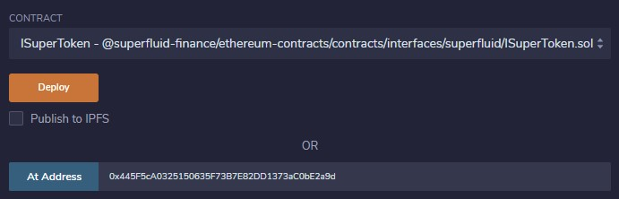
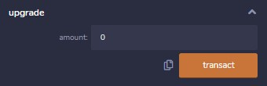
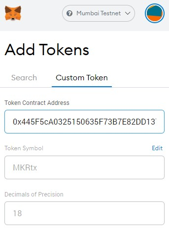

# Superfluid-ERC20-Wrapping
Creating a basic ERC20 token (named "testMaker") and wrapping this token into a streamable SuperFluid Super Token

### Implementation

1. Switch to Mumbai Testnet
    - Network Name: Mumbai Testnet
    - New RPC URL : https://rpc-mumbai.matic.today
    - Chain ID    : 80001

2. Deploy testMaker token (or use pre-deployed)
    * Deploy testMaker contract, set initial supply
    * **OR** skip to next step using testMaker token at 0xE9e2fCfC0A491C7dB9ABc20A12d18460C09c6816

3. Deploy Wrapped Super Token Contract
    * Run *createMakerSuperToken* function with address of testMaker token contract as argument
    * Run *getSuperToken* function with address of testMaker token contract as argument
        * This will provide the address of the Wrapped Super Token Contract on Mumbai testnet

4. Create Super Token
    * Load contract at address recieved from *getSuperToken* function with ISuperToken ABI - @superfluid-finance/ethereum-contracts/contracts/interfaces/superfluid/ISuperToken.sol *(see Remix example below)*
    
    

    * Use *upgrade* function to create Super Token
        * *Note* You can do a gut check by using the *symbol* function and see if it returns "MKRtx"

    

5. Add to MetaMask
    * If using MetaMask, you can use the address of the Super Token Contract to add the token

    